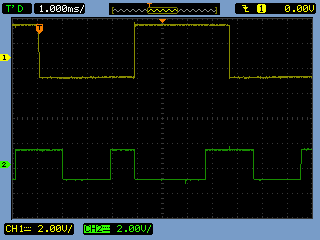
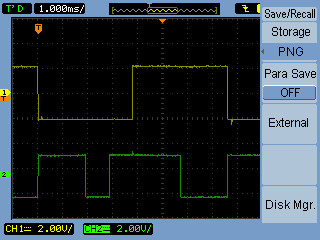
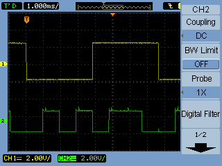

# Decoders and Multiplexers Lab 
This lab demonstrates the design and implementation of combinational logic circuits using decoders and multiplexers.

## 🔧 Tools Used
- KiCad for circuit design
- Breadboard for implementation
- Oscilloscope for waveform observation

## Circuit Diagrams

### Decoder Implementation (F1 and F2)

### Multiplexer Implementation

##  Waveform Observations

### F1

### F2

### MUX

